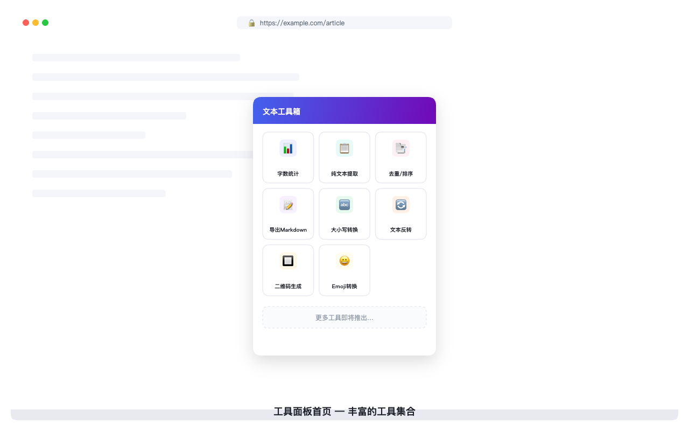
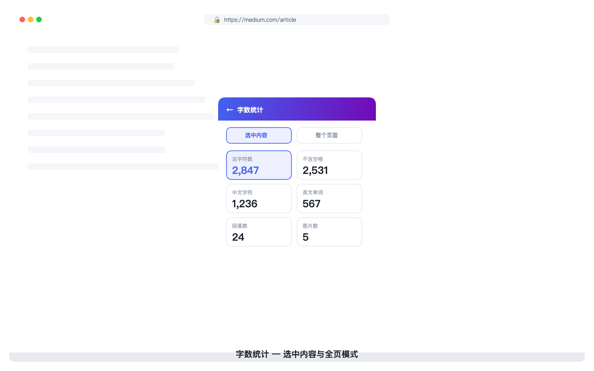
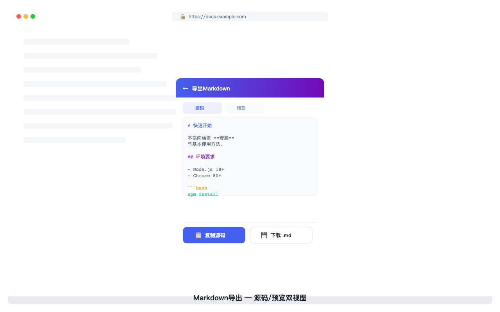

<div align="center">

# TextFlow 文本工具箱

一款轻量级、模块化的 Chrome 浏览器多功能网页辅助插件。

**即选即用 · 所见即所得 · 隐私优先**

[功能](#功能) • [安装](#安装) • [使用指南](#使用指南) • [截图](#截图) • [开发](#开发) • [隐私](#隐私)

</div>

---

## 功能

TextFlow 提供 8 种实用的文本处理工具，覆盖网页内容处理的常见场景：

| 工具 | 功能描述 |
|------|----------|
| 📊 字数统计 | 统计选中文本或全页面的字符数、中文字数、英文单词数、图片/视频/链接数量等 |
| 📋 纯文本提取 | 从网页中提取纯净文本，支持合并空行、保留链接 URL |
| 📑 去重/排序 | 对文本行进行去重、排序、去除空白行等操作 |
| 📝 导出 Markdown | 将网页内容转换为标准 Markdown 格式，支持复制源码或下载 .md 文件 |
| 🔤 大小写/风格转换 | 文本大小写转换（大写、小写、首字母大写）及多种风格格式 |
| 🔄 文本反转 | 支持字符反转、单词反转、行反转等多种反转方式 |
| 🔲 二维码生成 | 将选中文本或当前页面 URL 生成二维码，支持复制和下载 |
| 😄 Emoji 转换 | 文本与 Emoji 之间的相互转换 |

### 核心特性

- **即用即走** — 每个工具不超过 3 步完成操作
- **模块独立** — 工具间互不依赖，支持按需加载
- **隐私优先** — 所有数据处理均在本地浏览器完成，不收集、不上传任何用户数据
- **零侵入** — 不修改网页原有 DOM 结构
- **国际化** — 支持中文和英文界面
- **右键菜单** — 选中文本后右键快捷操作

---

## 安装

### 方法一：Chrome 应用商店（推荐）

<!-- TODO: 上架后替换为商店链接 -->
从 Chrome Web Store 安装（即将上架）。

### 方法二：开发者模式加载

1. 下载本项目代码：
   ```bash
   git clone https://github.com/kscje/Web-Toolkit.git
   ```
2. 打开 Chrome 浏览器，进入 `chrome://extensions/`
3. 开启右上角的 **"开发者模式"**
4. 点击 **"加载已解压的扩展程序"**
5. 选择项目根目录即可完成安装

---

## 使用指南

### 快速上手

1. 浏览任意网页时，选中你感兴趣的文本（可选）
2. 点击浏览器工具栏中的 TextFlow 图标
3. 在弹窗中选择需要的工具
4. 查看结果，并可复制或下载

### 右键菜单快捷操作

选中网页文本后，右键菜单中提供快捷入口：

- **统计选中字数** — 直接弹出字数统计结果
- **保存为 Markdown** — 转换选中内容为 Markdown
- **提取选中纯文本** — 提取纯净文本内容

### 设置页面

点击弹窗右上角的齿轮图标 ⚙️，可进行以下设置：

- **语言切换** — 中文 / English
- **功能块管理** — 启用/禁用特定工具，拖拽调整排列顺序

---

## 截图

| 首页工具列表 | 字数统计 | Markdown 导出 |
|:---:|:---:|:---:|
|  |  |  |

---

## 技术栈

| 层级 | 技术选型 | 说明 |
|------|---------|------|
| **扩展标准** | Chrome Manifest V3 | 最新扩展规范，Service Worker 替代 Background Page |
| **前端** | 原生 JavaScript (IIFE + Revealing Module) | 无框架依赖，ES5 兼容写法 |
| **样式** | 原生 CSS | 无预处理器，CSS 变量体系 |
| **存储** | chrome.storage.local + localStorage | 双环境兼容 |
| **国际化** | 自研 i18n 模块 | JSON 语言包 + DOM 属性驱动渲染 |
| **后端** | Cloudflare Workers + D1 | 仅用于用户建议提交 |
| **通信** | Chrome Extension Messaging API | 组件间消息通信 |

---

## 项目结构

```
TextFlow/
├── manifest.json            # Chrome 扩展清单
├── popup.html / popup.js    # 弹窗主入口
├── options.html / options.js# 设置页面
├── background.js            # Service Worker
├── content.js               # 内容脚本（注入网页）
│
├── tools/                   # 工具模块（按需懒加载）
│   ├── wordcount.js         # 字数统计
│   ├── markdown.js          # Markdown 导出
│   ├── plaintext.js         # 纯文本提取
│   ├── qrcode.js            # 二维码生成
│   ├── caseconverter.js     # 大小写转换
│   ├── textreverser.js      # 文本反转
│   ├── textdedup.js         # 去重/排序
│   └── emoji_converter.js   # Emoji 转换
│
├── utils/                   # 公共基础设施
│   ├── core.js              # 配置管理 + 存储管理 + 建议工具
│   └── i18n.js              # 国际化模块
│
├── locales/                 # 国际化语言包
├── styles/                  # 样式表
├── icons/                   # 插件图标
├── backend/                 # 后端服务 (Cloudflare Workers)
└── libs/                    # 第三方库
```

---

## 开发指南

### 环境要求

- Chrome 浏览器 80+
- Node.js（用于生成国际化文件）

### 本地开发

```bash
# 克隆项目
git clone https://github.com/kscje/Web-Toolkit.git
cd Web-Toolkit

# 同步国际化文件（修改语言包后需要执行）
node scripts/generate_locales.js
```

在 Chrome 中加载已解压的扩展程序后，修改代码刷新页面即可生效。

### 如何新增一个工具

1. 在 `tools/` 下创建新工具文件（参考现有工具的实现）
2. 在 `locales/zh.json` 和 `locales/en.json` 中添加翻译
3. 运行 `node scripts/generate_locales.js` 同步生成 `_locales`
4. 在 `popup.html` 中添加工具视图和首页卡片
5. 在 `popup.js` 中注册模块并添加交互逻辑
6. 如有需要，在 `content.js` 中添加对应的消息处理

详细扩展指南请参考 [ARCHITECTURE.md](ARCHITECTURE.md)。

### 发布打包

```bash
# 1. 同步国际化文件
node scripts/generate_locales.js

# 2. 验证 JSON 文件格式
node -e "for (const f of ['manifest.json','locales/en.json','locales/zh.json','_locales/en/messages.json','_locales/zh_CN/messages.json']) JSON.parse(require('fs').readFileSync(f,'utf8')); console.log('JSON OK')"
```

打包应包含：`manifest.json`、`popup.html`/`js`、`options.html`/`js`、`background.js`、`content.js`、`utils/`、`tools/`、`styles/`、`icons/`、`libs/`、`locales/`、`_locales/`

---

## 隐私

TextFlow 高度重视用户隐私：

- **数据本地化** — 所有文本处理均在用户浏览器本地完成
- **不上传内容** — 不会将用户的浏览数据或文本内容上传至任何服务器
- **最小权限** — 仅申请 `activeTab`、`storage`、`clipboardWrite`、`contextMenus` 等必要权限
- **无远程代码** — 所有代码打包在插件内，不远程加载外部脚本
- **严格 CSP** — 配置了严格的内容安全策略

> 用户建议提交功能仅在用户主动提交时，将建议内容发送到 Cloudflare Worker 后端存储，用于功能迭代参考。

---

## 路线图

| 版本 | 规划内容 |
|------|----------|
| **V1.0** ✅ | 核心工具集（字数统计、Markdown 导出、纯文本提取、二维码等 8 个工具） |
| **V1.1.0** 🔜 | 网页剪藏：保存页面/选中文本、最近剪藏、剪藏导出、保存到网页剪藏右键入口 |
| **Backlog** | 非网页剪藏相关功能统一进入待排期：统计历史、导出体验优化、暗色模式、网页翻译、链接提取、图片提取、工具市场、工作流、云端配置同步等 |

V1.1.0 网页剪藏功能设计与实现指导见：[doc/WEB_CLIP_V1_1_0_GUIDE.md](doc/WEB_CLIP_V1_1_0_GUIDE.md)。

---

<div align="center">

**Made with ❤️**

</div>
